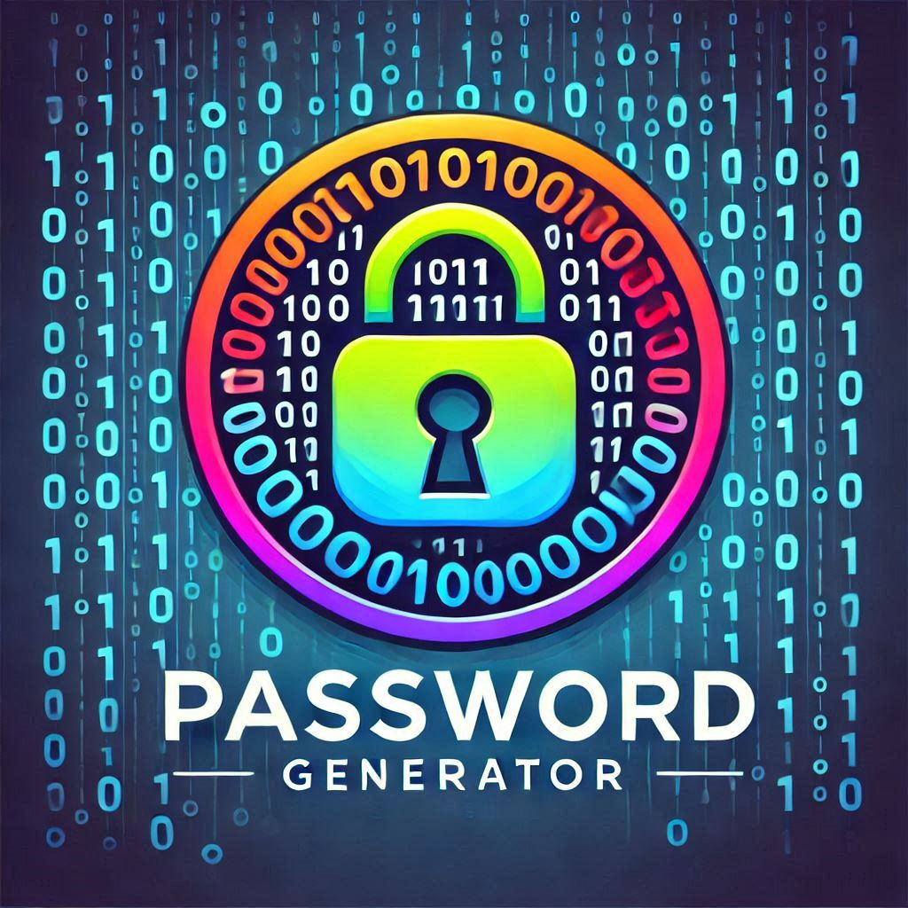

<div align="center">

# 🔐 Password Generator



### *Secure • Simple • Swift*

[](LICENSE)
[](https://developer.mozilla.org/en-US/docs/Web/HTML)
[](https://developer.mozilla.org/en-US/docs/Web/CSS)
[](https://developer.mozilla.org/en-US/docs/Web/JavaScript)

Generate powerful, customizable passwords with style – protect your digital life with one click!

[Demo](#demo) • [Features](#sparkles-key-features) • [Installation](#rocket-quick-start) • [Usage](#compass-how-to-use) • [Contribute](#handshake-contribute)

</div>

---

## ✨ Why Choose This Password Generator?

In today's digital world, weak passwords are the #1 security vulnerability. Our Password Generator creates **unbreakable passwords** tailored to your needs, with a beautiful interface that makes security simple and accessible for everyone.

<div align="center">
  
</div>

## :sparkles: Key Features

<div align="center">

| 🎛️ **Customization** | 🛡️ **Security** | 🌓 **Design** | 🔄 **Utility** |
|:-------------------:|:---------------:|:-------------:|:--------------:|
| Adjustable length (4-30) | Real-time strength indicator | Light & dark modes | One-click copy |
| Character type toggles | Color-coded feedback | Modern interface | Visual notifications |
| Comprehensive options | Smart security analysis | Responsive layout | Accessibility support |

</div>

## :rocket: Quick Start

### No Installation Required!

This is a standalone web application that runs entirely in your browser.

#### Option 1: Live Demo
▶️ [Try it now on GitHub Pages](https://alok-devforge.github.io/PasswordGenerator/)

#### Option 2: Run Locally
```bash
# Clone the repository
git clone https://github.com/alok-devforge/PasswordGenerator.git

# Open index.html in your browser
```

## :compass: How to Use

<div align="center">

</div>

<div align="center">

| 1️⃣ **Configure** | 2️⃣ **Generate** | 3️⃣ **Copy & Use** |
|:----------------:|:----------------:|:------------------:|
| Set length with slider | Click "Generate Password" | Click "Copy Password" |
| Toggle character options | Check strength indicator | Paste wherever needed |
| Enable dark mode if desired | | Enjoy your secure password |

</div>

## :shield: Security Guarantee

- **100% Client-side**: All generation happens in your browser
- **Zero Data Transfer**: No passwords are sent to any servers
- **No Storage**: Passwords aren't saved anywhere after page refresh
- **Open Source**: Code is transparent and reviewable by anyone

## :art: Tech Stack Highlights

- **HTML5** - Semantic structure with accessibility features
- **CSS3** - Responsive design with smooth transitions and animations
- **JavaScript** - Robust functionality with no external dependencies
- **Font Awesome** - Premium icons for an enhanced visual experience
- **Google Fonts** - Typography that balances style and readability

## :handshake: Contribute

Your contributions make this project better for everyone! Here's how to join:

1. 🍴 Fork the repository
2. 🌱 Create your feature branch (`git checkout -b amazing-feature`)
3. 💻 Make your changes
4. 📝 Commit with clear messages (`git commit -m 'Add amazing feature'`)
5. 🚀 Push to your branch (`git push origin amazing-feature`)
6. 🔍 Open a Pull Request

All contributions, big or small, are warmly welcomed!

## :memo: License

This project is licensed under the MIT License - see the [LICENSE](LICENSE) file for details.

## :star2: Future Enhancements

- Password history tracking
- Password strength comparison tools
- Pronounceable password generation
- Password expiration reminders
- Multi-language support

---

<div align="center">

### Made with ❤️ by [alok-devforge](https://github.com/alok-devforge)

<p>If you found this project helpful, consider giving it a ⭐️ on GitHub!</p>
<p>Last updated: 2025-04-28 17:06:05</p>

</div>
